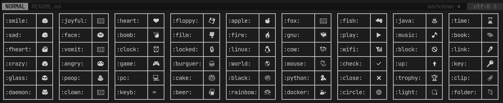

# vim-simple-emoji
A simple auto-complete of emoji for Vim. As short as possible!

[](https://terminalroot.com.br/)
[](https://github.com/sindresorhus/awesome)




> I got tired of installing plugins that had a very large number of emoji, since most of those +1,000 I only used around 50 at most. So I created this one that in addition to less emojis is easier to use.

# Instalation
Use Vundle:
```sh
Plugin 'terroo/vim-simple-emoji'
" :PluginInstall
```

Use vim-plug

```sh
Plug 'terroo/vim-simple-emoji'
" :PlugInstall"
```

# Use
Enter the name of the emoji between two points and then press the *[space]* button and the emoji will be displayed at the cursor position. Example:
```viml
:smile:<space>
```
This will result in: 😃 

## How to know the name of all emojis?
The list of all names you can get by running the command: `:ShowEmoji`.
> Some names have been modified to make them more peculiar, example: `:linux:` will display the penguin 🐧 

# License
[GNU GPLv3](LICENSE)


